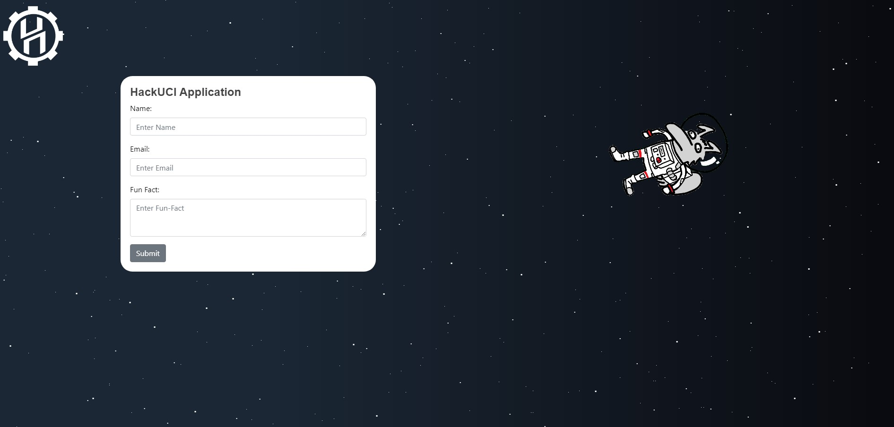
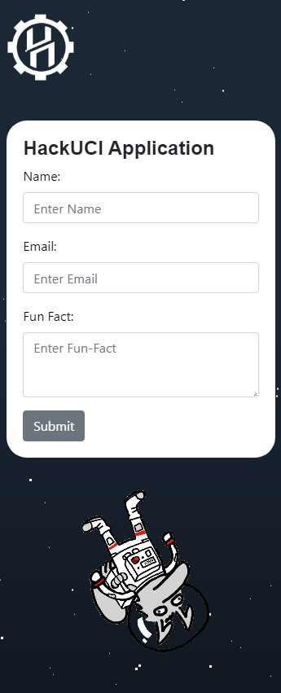
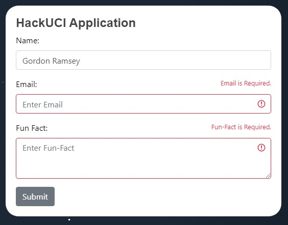
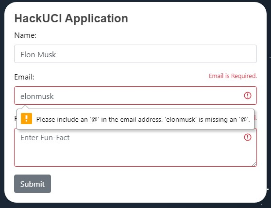
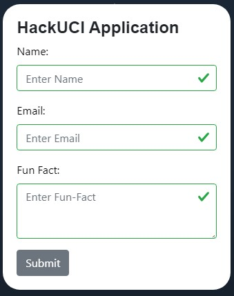
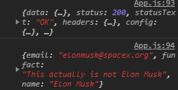

##

##
### Acknowledgements:
```
Paralax Stars - CSS 
    Original Template Made By Saransh Sinha
    linkedin.com/in/saranshsinha
    https://codepen.io/saransh/pen/BKJun
```
### How it looks:
```
Desktop View:
```

```
Mobile View:
```


### Working Input? You betcha!
```
Trying to Submit with an empty form results in:
```

```
Submitting with only a name results in:
```

```
Email Verfication before submitting a GET request? Yes!
```

```
Form visibily successfuly? and cleared?
```

```
Check out that sweet 200 Response!
```


### Made with React.js & Bootstrap 4
