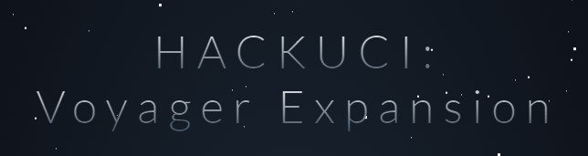
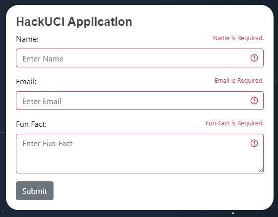

##

##
### Acknowledgements:
```
Paralax Stars - CSS 
    Original Template Made By Saransh Sinha
    linkedin.com/in/saranshsinha
    https://codepen.io/saransh/pen/BKJun
```
### How was building it:
```
This was my first project in React.js and also my first time experiementing with 
HTML Requests. As a result, it is a little bit sloppier than how I would like it to be.
Nonetheless, I understand that this is a learning process.

Thus, I hope to be able to participate in more HackUCI events in the future to better 
develop my programming abilities. It was actually ZotHacks 2019 that first introduced 
me to web development and ever since then I have been experiementing whenever I had time.

This deliverable had me experiment with a lot of things I was not previously comfortable 
with. For example: 

    React.js, Axios (HTML Requests), and CSS Media Queries.

All of which are essential to proper web design. So I am actually grateful for this
opportunity as it allowed me to grow and exit my comfort zone! Thank you!
```

### How it looks:
```
Desktop View (Left to Right Gradient):
```

```
Mobile View (Top to Bottom Gradient):
```


### Working Input? You betcha!
```
Trying to Submit with an empty form results in:
```

```
Submitting with only a name results in:
```

```
Email Verfication before submitting a GET request? Yes!
```

```
Form visibily successfuly? and cleared?
```

```
Check out that sweet 200 Response!
```


### Made with React.js & Bootstrap 4
